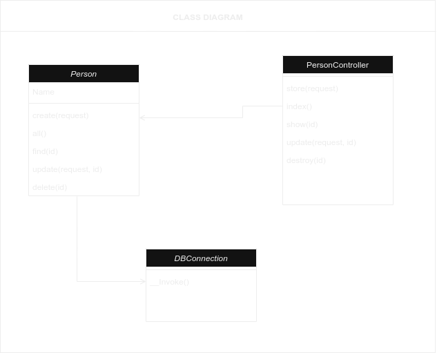

<div align="center">
  <h2><b>🕹️🕹️ Stage 2 HNG [Person API] 🕹️🕹️</b></h2>
  <br/>
</div>

<a name="readme-top"></a>

<!-- TABLE OF CONTENTS -->

# 📗 Table of Contents

- [📖 About the Project](#about-project)
    - [🛠 Built With](#built-with)
        - [Tech Stack](#tech-stack)
        - [Key Features](#key-features)
    - [🚀 Link to Api Docs](#api-docs)
    - [ERD Diagram](#erd)
- [💻 Getting Started](#getting-started)
    - [Setup](#setup)
    - [Prerequisites](#prerequisites)
    - [Usage](#usage)
- [🔭 Future Features](#future-features)
- [🤝 Contributing](#contributing)
- [⭐️ Show your support](#support)
- [📝 License](#license)

<!-- PROJECT DESCRIPTION -->

# 📖 Person API <a name="about-project"></a>

**[Person API]** is a simple REST API capable of CRUD operations on a "person" resource, interfacing with MySQL database. The API dynamically handle parameters, such as adding or retrieving a person by name.


### Tech Stack <a name="tech-stack"></a>

- <a href="https://www.php.net/">PHP</a>
- <a href="https://www.mysql.com/">MySQL</a>

<!-- Features -->

### Key Features <a name="key-features"></a>

- **[CRUD operation]**

<p align="right">(<a href="#readme-top">back to top</a>)</p>

<!-- Api Documentation -->

## 🚀 Api Documentation <a name="api-docs"></a>

### List All Persons

Retrieve a list of all persons.

- **URL**: `/api`
- **HTTP Method**: GET
- **Response**:
    - **Status Code**: 200 OK
    - **Response Body**: An array of person records.
      ```json
      [
          {
              "id": 1,
              "name": "John Doe"
          },
          {
              "id": 2,
              "name": "Alice Smith"
          }
      ]
      ```

### Retrieve a Person

Retrieve a person record by ID.

- **URL**: `/api/{param}`
- **HTTP Method**: GET
- **Parameters**:
    - `param` (path parameter, string) - The name or ID of the person to retrieve.
- **Response**:
    - **Status Code**: 200 OK
    - **Response Body**: A person record.
      ```json
      {
          "id": 1,
          "name": "John Doe"
      }
      ```

### Create a Person

Create a new person record.

- **URL**: `/api`
- **HTTP Method**: POST
- **Request Body**:
    - `name` (string, required) - The name of the person.
      ```json
      {
          "name": "Alice Smith"
      }
      ```
- **Response**:
    - **Status Code**: 200 OK
    - **Response Body**: A success message and the created person record.
      ```json
      {
          "message": "Person saved successfully",
          "data": {
              "id": 3,
              "name": "Alice Smith"
          }
      }
      ```

### Update a Person

Update an existing person record by ID.

- **URL**: `/api/{id}`
- **HTTP Method**: PUT
- **Parameters**:
    - `id` (path parameter, integer) - The ID of the person to update.
- **Request Body**:
    - `name` (string, required) - The updated name of the person.
      ```json
      {
          "name": "Alice Johnson"
      }
      ```
- **Response**:
    - **Status Code**: 200 OK
    - **Response Body**: A success message and the updated person record.
      ```json
      {
          "message": "Updated successfully",
          "data": {
              "id": 3,
              "name": "Alice Johnson"
          }
      }
      ```

### Delete a Person

Delete a person record by ID.

- **URL**: `/api/{id}`
- **HTTP Method**: DELETE
- **Parameters**:
    - `id` (path parameter, integer) - The ID of the person to delete.
- **Response**:
    - **Status Code**: 200 OK
    - **Response Body**: A success message and the deleted person record.
      ```json
      {
          "message": "Deleted successfully",
          "data": {
              "id": 3,
              "name": "Alice Johnson"
          }
      }
      ```

<br/>


<p align="right">(<a href="#readme-top">back to top</a>)</p>

## 📊 ERD Diagram <a name="erd"></a>


## 📊 Class Diagram <a name=""></a>



<p align="right">(<a href="#erd">back to top</a>)</p>

<!-- GETTING STARTED -->

## 💻 Getting Started <a name="getting-started"></a>

To get a local copy up and running, follow these steps.

### Prerequisites

In order to run this project you need:

1. git <br>
   use the following link to setup `git` if you dont have it already installed on your computer
<p align="left">(<a href="https://git-scm.com/book/en/v2/Getting-Started-Installing-Git">install git</a>)</p>

2. PHP ^8.1 <br>
   use the following link to setup `PHP` if you dont have it already installed on your computer
<p align="left">(<a href="https://www.php.net/manual/en/install.php">install PHP</a>)</p>

3. Composer <br>
   use the following link to Download `Composer` if you dont have it already installed on your computer
<p align="left">(<a href="https://getcomposer.org/download/">install Composer</a>)</p>

4. MySQL <br>
   use the following link to setup `MySQL` if you dont have it already installed on your computer
<p align="left">(<a href="https://dev.mysql.com/doc/mysql-getting-started/en/">install MySQL</a>)</p>

5. Apache Server <br>
   use the following link to setup `Apache` if you dont have it already installed on your computer
<p align="left">(<a href="https://httpd.apache.org/docs/2.4/install.html">install Apache</a>)</p>


## Install

Clone repo:

```
git clone https://github.com/mp-learning-journey/stage-2-hng.git
```
clone into `htdocs` for windows, and `www` for linux

Install dependencies:

```
composer install
```

## Setup

- Create a database
- Create a .env file using the .env.example file and update the Database info.
- change line 3 of the .htaccess to suite your project folder directory
```apacheconf
RewriteBase /stage-2-hng
```
- Run the above SQL query in your database
```MYSQL
CREATE TABLE `person` (
  `id` int PRIMARY KEY AUTO_INCREMENT,
  `name` varchar(255) NOT NULL ,
  `created_at` timestamp,
  `updated_at` timestamp
);
```

### Usage

Start your server and goto the above url on your browser

http://localhost/stage-2-hng/api

<p align="right">(<a href="#readme-top">back to top</a>)</p>


<!-- CONTRIBUTING -->

## 🤝 Contributing <a name="contributing"></a>

Contributions, issues, and feature requests are welcome!

Feel free to check the [issues page](../../issues/).

<p align="right">(<a href="#readme-top">back to top</a>)</p>

<!-- SUPPORT -->

## ⭐️ Show your support <a name="support"></a>

If you like this project, please don't forget to follow the contributors and give it a star.

<p align="right">(<a href="#readme-top">back to top</a>)</p>

<!-- LICENSE -->

## 📝 License <a name="license"></a>

This project is [MIT](./LICENSE) licensed.

<p align="right">(<a href="#readme-top">back to top</a>)</p>


